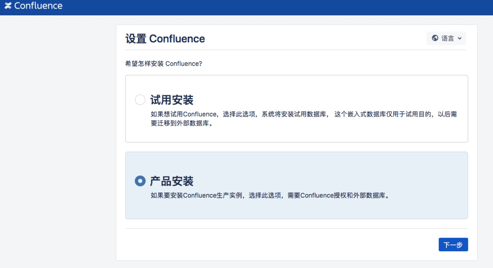

# Centos 6.8  Install  Confluence 6.8
1. wget https://product-downloads.atlassian.com/software/confluence/downloads/atlassian-confluence-6.8.0-x64.bin
2. wget http://download.oracle.com/otn-pub/java/jdk/8u161-b12/2f38c3b165be4555a1fa6e98c45e0808/jdk-8u161-linux-x64.rpm
3. wget https://dev.mysql.com/get/Downloads/Connector-J/mysql-connector-java-5.1.46.tar.gz 
4. wget https://downloads.mysql.com/archives/community/   下载mysql5.7.20版本
# Install  confluence
1. ./atlassian-confluence-6.8.0-x64.bin安装好以后需要配置下/atlassian/confluence/conf/server.xml在server.xml加入后面这一行 proxyName="haodongz.com" proxyPort="80"/>
 server.xml 在这个里面添加Confluence域名JIRA也是一样。

2. 此时会出现授权码需要在网上搜索下载注册机如下图,把服务器ID填写到注册机破解

3. 进到confluence安装目录/atlassian/confluence/confluence/WEB-INF/lib/atlassian-extras-decoder-v2-3.3.0.jar把这个软件包下载到本地修改成atlassian-extras-2.4.jar
 然后用注册机打开破解,破解完成后还需要上传到下载原文件的目录改成原来的名字就好了破解完成。

